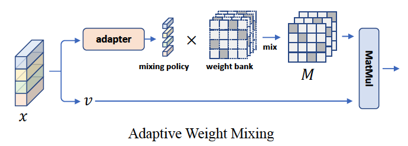

# AMixer 

Created by [Yongming Rao](https://raoyongming.github.io/), [Wenliang Zhao](https://wl-zhao.github.io/), [Jie Zhou](https://scholar.google.com/citations?user=6a79aPwAAAAJ&hl=en&authuser=1), [Jiwen Lu](https://scholar.google.com/citations?user=TN8uDQoAAAAJ&hl=en&authuser=1)

This repository contains PyTorch implementation for AMixer.

AMixer is a family of self-attention free vision Transfromers using adaptive weight mixing to generate attention weights without token-token
interactions.




🔥 **News**
- Our new work [HorNet](https://github.com/raoyongming/HorNet) has been accepted by NeurIPS 2022. HorNet achieves 87.7% top-1 accuracy on ImageNet, 57.9% mIoU on ADE20K and 59.2% bounding box AP on COCO. Welcome to try the more powerful and generic model. 


## ImageNet Classification

### Requirements

- torch==1.8.0
- torchvision==0.9.0
- timm==0.4.12
- tensorboardX 


**Data preparation**: download and extract ImageNet images from http://image-net.org/. The directory structure should be

```
│ILSVRC2012/
├──train/
│  ├── n01440764
│  │   ├── n01440764_10026.JPEG
│  │   ├── n01440764_10027.JPEG
│  │   ├── ......
│  ├── ......
├──val/
│  ├── n01440764
│  │   ├── ILSVRC2012_val_00000293.JPEG
│  │   ├── ILSVRC2012_val_00002138.JPEG
│  │   ├── ......
│  ├── ......
```

### Training

To train AMixer models on ImageNet from scratch, run:

**AMixer-DeiT-S**

```
python -m torch.distributed.launch --nproc_per_node=8 main.py \
--model amixer_deit_s  \  
--batch_size 128 --lr 1e-3 --update_freq 1 \
--model_ema true --model_ema_eval true \
--data_path /path/to/imagenet-1k \
--output_dir ./logs/amixer_deit_s
```

**AMixer-T**

```
python -m torch.distributed.launch --nproc_per_node=8 main.py \
--model amixer_t  \ 
--batch_size 128 --lr 1e-3 --update_freq 1 \
--model_ema true --model_ema_eval true \
--data_path /path/to/imagenet-1k \
--output_dir ./logs/amixer_t
```

**AMixer-S**

```
python -m torch.distributed.launch --nproc_per_node=8 main.py \
--model amixer_s \ 
--batch_size 64 --lr 1e-3 --update_freq 2 \
--model_ema true --model_ema_eval true \
--data_path /path/to/imagenet-1k \
--output_dir ./logs/amixer_s
```

**AMixer-B**

```
python -m torch.distributed.launch --nproc_per_node=8 main.py \
--model amixer_b  \
--batch_size 32 --lr 1e-3 --update_freq 4 \
--model_ema true --model_ema_eval true \
--data_path /path/to/imagenet-1k \
--output_dir ./logs/amixer_b
```


## License
MIT License


## Citation
If you find our work useful in your research, please consider citing:
```
@inproceedings{rao2022amixer,
  title={AMixer: Adaptive Weight Mixing for Self-attention Free Vision Transformers},
  author={Rao, Yongming and Zhao, Wenliang and Zhou, Jie and Lu, Jiwen},
  booktitle={European Conference on Computer Vision},
  pages={50--67},
  year={2022},
  organization={Springer}
}
```
